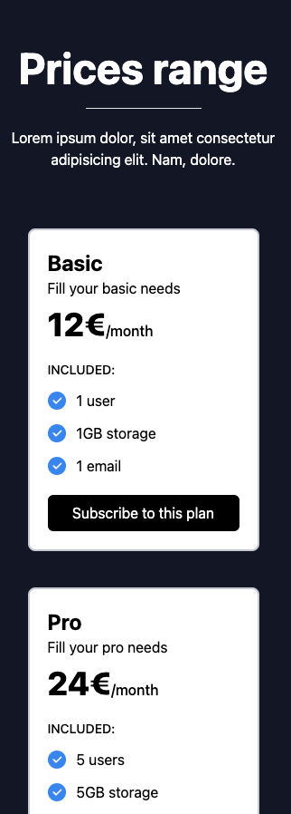

# TailwindCSS-Component: Pricing

Welcome to the repository for a customizable and responsive pricing component designed using TailwindCSS. 
This component is tailored for service-based businesses that offer tiered pricing plans. 
It is built to be both visually appealing and functional across all device types, utilizing TailwindCSS via Play CDN for ease of integration.

## Features

- Responsive design suitable for all devices.
- Multiple pricing tiers to cater to different customer needs.
- Clear and attractive layout to enhance user engagement.
- Easy integration with no installation required using TailwindCSS Play CDN.

## Preview

Desktop view:


Tablet view:


Mobile view:



## Usage

To incorporate this pricing component into your project, copy the contents of `pricing.html` and `pricing.css` from this repository. Ensure that your project's HTML contains the TailwindCSS CDN if not already included:

```html
<!-- TailwindCSS CDN Link -->
<link href="https://cdn.tailwindcss.com" rel="stylesheet">
```

## Access

For a live demonstration of the pricing component, visit: https://eliottdelhaye.github.io/TailwindCSS-Component-Pricing/
